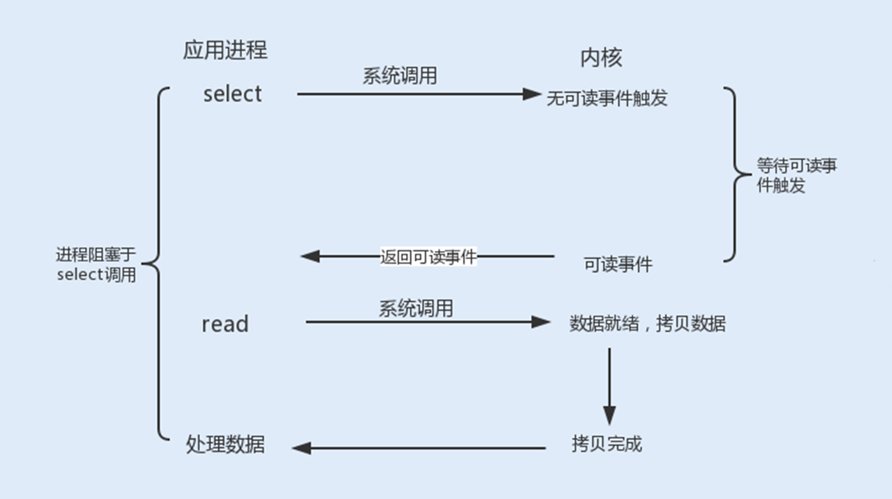
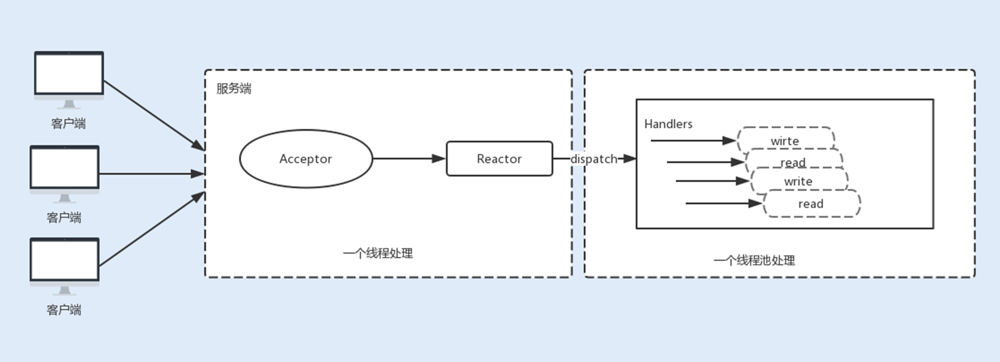
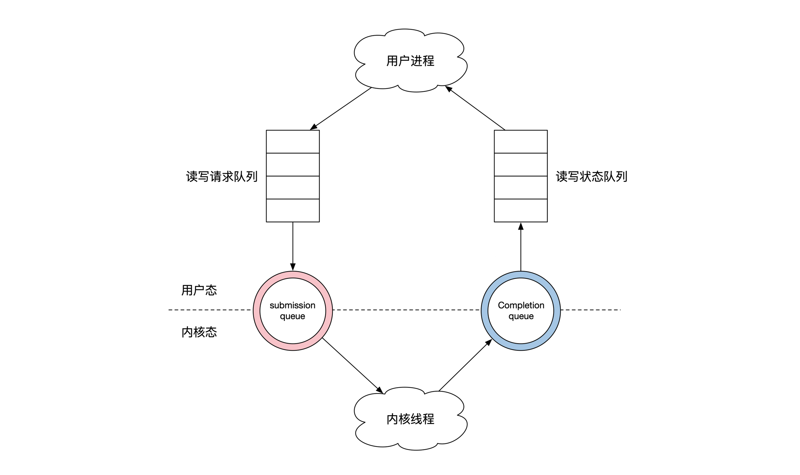
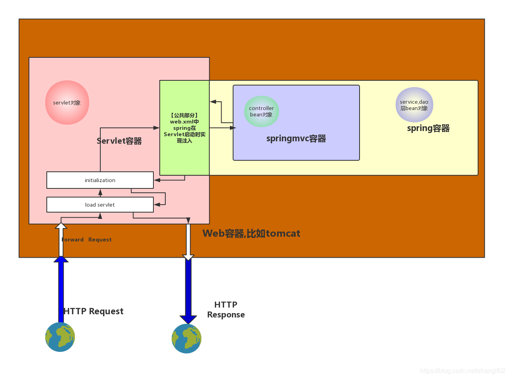
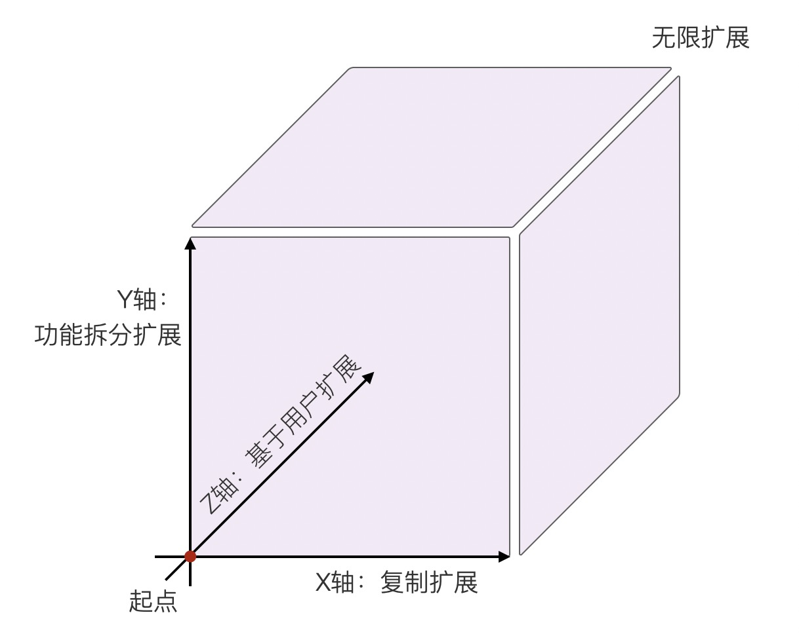
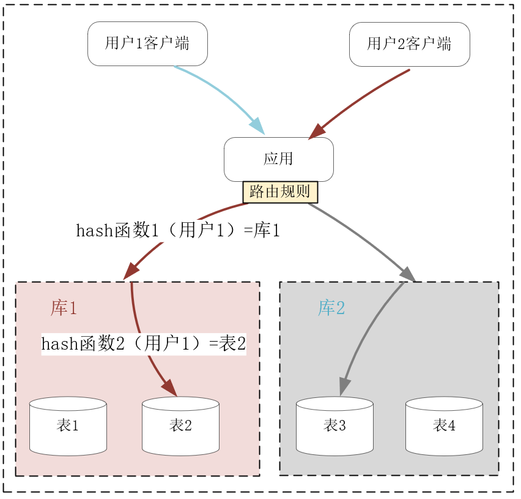
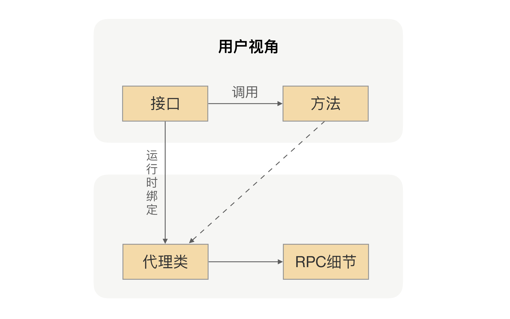
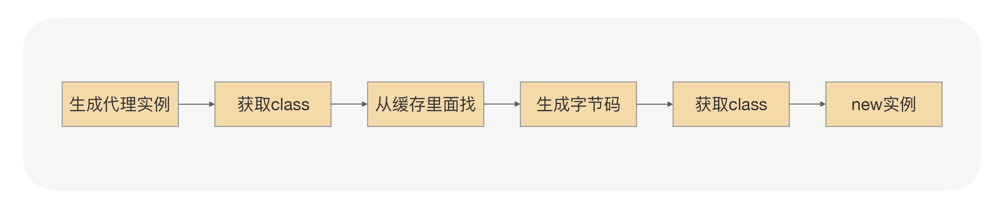
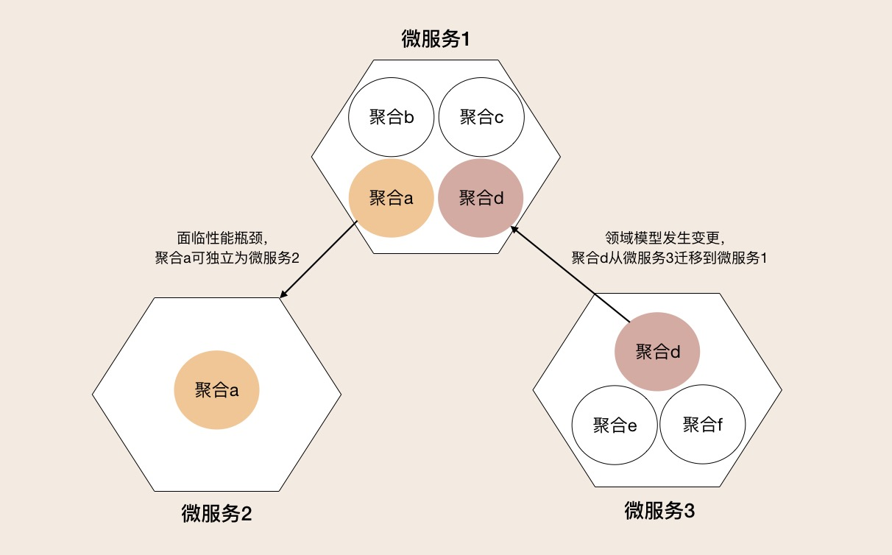
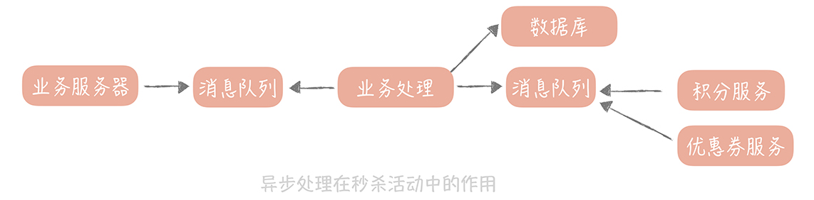

毕业项目

1、 **(必做)** 分别用 100 个字以上的一段话，加上一幅图 (架构图或脑图)，总结自己
对下列技术的关键点思考和经验认识:

1)JVM

* 发展时间很长，很成熟
  * HotSpot近千个可调整参数[1]
  * GC已经发展得非常复杂
* 存在一些历史包袱
  * Java原本是对长时间运行的应用优化的
    * 理论上JIT优化的结果会更好，因为可以知晓运行时的实际情况[2]
  * 云原生时代，更看重应用冷启动时间[3]
    * AOT会比JIT更重要
* 字节码工具更像是hack
  * 运行时动态生成/修改代码本是脚本语言的特性
  * 没有接口的情况下通过生成子类来代理/增强对象像是掩耳盗铃
    * 业务开发中的实践通常是组合优于继承，避免通过继承来复用代码[4]

2)NIO

* 主流的I/O复用模式依旧存在阻塞时间[5]

* 为在阻塞时充分利用CPU，不得不使用线程池

* 减少内核态切换：io_uring[6]

  * Netty已有试验实现[7]，简单测试下性能提升明显
    * 因为Java运行时还不支持，只能通过JNI实现

3) 并发编程

* 最好不要写多线程
  * Java 5之前内存模型不完善
  * 直接操作并发原语，心智负担大[8]
* 能用单线程的就不用多线程
  * Redis只用单线程性能也很好
  * OpenResty[9]和Node.js[10]等，同步非阻塞的写法，没有异步调用的回调地狱

4)Spring 和 ORM 等框架

* Spring
  * Spring早就从屠龙勇士变成了龙
  * 容器套娃[11]

    * 到了Spring Boot又反过来包住了Tomcat
  * 通过容器管理对象生命周期的一个好处是在运行时替换对象
    * 对于企业级的单体应用，不停机维护很重要
    * 云原生时代，对分布式应用可能没那么重要
  * 依赖注入有些被滥用
    * `@Autowired`私用成员存在隐式依赖
  * 值得学习的地方
    * production ready
    * 基础设施对业务非侵入
      * framework-less framework
    * 各种可替换的标准组件
* ORM
  * 解决对象关系阻抗不匹配[12]
  * 复杂的查询还是需要写SQL
  * ActiveRecord模式混淆了领域对象和持久化对象

5)MySQL 数据库和 SQL

* MySQL
  * 传统的OLTP数据库，对于中等规模应用成熟稳定
  * 用于OLAP或分布式应用都需要改造，不如直接用各自领域的成熟产品[13]
    * OLAP可直接选用列式存储的数据库
    * 分布式应用可选用NewSQL数据库
* SQL
  * 关系代数完整理论支持，难以取代

6) 分库分表

* Z轴扩展[14]

* 影响join操作和聚合操作等，需妥善设计[15]

7)RPC 和微服务

* RPC架构，功能与API网关重合
  * 路由
  * 服务注册和发现
  * 服务治理
* RPC非侵入实现[16]

* 微服务架构演化[17]

  * 微服务拆分时，原有内部调用变为RPC调用
  * 微服务合并式，原有RPC调用变为内部调用

8) 分布式缓存

* 风险[18]
  * 穿透
  * 击穿
  * 雪崩
  * 污染

9) 分布式消息队列

* 多种实现模式中的核心组件[19]
  * 削峰填谷

  * 异步处理

  * 解耦合

### 参考
* [1] [开篇词 \| 为什么我们要学习Java虚拟机？-极客时间](https://time.geekbang.org/column/article/11074)
* [2] [01 \| Java代码是怎么运行的？-极客时间](https://time.geekbang.org/column/article/11289)
* [3] [云原生时代，Java的危与机-InfoQ](https://www.infoq.cn/article/RQfWw2R2ZpYQiOlc1WBE)
* [4] [15 \| 面向对象之继承：继承是代码复用的合理方式吗？-极客时间](https://time.geekbang.org/column/article/252605)
* [5] [11 \| 答疑课堂：深入了解NIO的优化实现原理-极客时间](https://time.geekbang.org/column/article/100861)
* [6] [11 \|  系统优化：如何让金融系统运行得更快？-极客时间](https://time.geekbang.org/column/article/332958)
* [7] [GitHub - netty/netty-incubator-transport-io_uring](https://github.com/netty/netty-incubator-transport-io_uring)
* [8] [Brian Kernighan: Debugging is twice as hard as writing the code in the first place. Therefore, if you write the code as cleverly as possible, you are, by definition, not smart enough to debug it.](https://www.quotes.net/quote/57502)
* [9] [01 \| 初探OpenResty的三大特性-极客时间](https://time.geekbang.org/column/article/97459)
* [10] [17 \| 异步：异步编程之async/await-极客时间](https://time.geekbang.org/course/detail/100036001-146470)
* [11] [03 \| 你应该知道的Servlet规范和Servlet容器-极客时间](https://time.geekbang.org/column/article/95480)
* [12] [10 \| 数据存储的合理性：金融业务可以不用关系型数据库吗？-极客时间](https://time.geekbang.org/column/article/332304)
* [13] [18 \| HTAP是不是赢者通吃的游戏？-极客时间](https://time.geekbang.org/column/article/287246)
* [14] [21 \| AKF立方体：怎样通过可扩展性来提高性能？-极客时间](https://time.geekbang.org/column/article/252741)
* [15] [18 \| 可伸缩架构案例：数据太多，如何无限扩展你的数据库？-极客时间](https://time.geekbang.org/column/article/218385)
* [16] [05 \| 动态代理：面向接口编程，屏蔽RPC处理流程-极客时间](https://time.geekbang.org/column/article/205910)
* [17] [07 \| DDD分层架构：有效降低层与层之间的依赖-极客时间](https://time.geekbang.org/column/article/156849)
* [18] [22 \| 分布式缓存如何与本地缓存配合，提高系统性能？-极客时间](https://time.geekbang.org/column/article/328981)
* [19] [17 \| 消息队列：秒杀时如何处理每秒上万次的下单请求？-极客时间](https://time.geekbang.org/column/article/156904)

毕业总结

毕业总结写在 README 文件里即可。

* 课程好的地方
  * 大纲看上去挺完整
* 课程不好的地方
  * 课堂上时间有限，广度和深度不可兼得
    * 另外购买了很多推荐的课程和书籍，直到学期结束看完不到1/3
    * 作业对于零基础者要求偏高
* 课程丑陋的地方
  * 疑似给开源社区导流
    * 并不一定是坏事，社区自行造血可以多赢
  * 可能加剧行业内卷
* 个人收获
  * Java生态体系完整，有很多值得学习的地方
  * 似乎Java P7已经很卷了，不想参合[20]

### 参考
* [20] [“内卷化”系统出逃指南-虎嗅网](https://www.huxiu.com/article/408084.html)