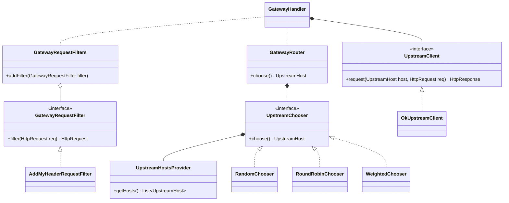

Week03 作业题目（周四）：

基础代码可以 fork： https://github.com/kimmking/JavaCourseCodes
02nio/nio02 文件夹下
实现以后，代码提交到 Github。

1. （必做）整合你上次作业的 httpclient/okhttp；

[点击看大图](https://mermaid.ink/svg/eyJjb2RlIjoiY2xhc3NEaWFncmFtXG4gIGNsYXNzIEdhdGV3YXlSZXF1ZXN0RmlsdGVyIHtcbiAgICArZmlsdGVyKEh0dHBSZXF1ZXN0IHJlcSkgSHR0cFJlcXVlc3RcbiAgfVxuICA8PGludGVyZmFjZT4-IEdhdGV3YXlSZXF1ZXN0RmlsdGVyXG5cbiAgR2F0ZXdheVJlcXVlc3RGaWx0ZXIgPHwuLiBBZGRNeUhlYWRlclJlcXVlc3RGaWx0ZXJcblxuICBjbGFzcyBHYXRld2F5UmVxdWVzdEZpbHRlcnMge1xuICAgICthZGRGaWx0ZXIoR2F0ZXdheVJlcXVlc3RGaWx0ZXIgZmlsdGVyKVxuICB9XG4gIEdhdGV3YXlSZXF1ZXN0RmlsdGVycyBvLS0gR2F0ZXdheVJlcXVlc3RGaWx0ZXJcblxuICBjbGFzcyBVcHN0cmVhbUNob29zZXIge1xuICAgICtjaG9vc2UoKSBVcHN0cmVhbUhvc3RcbiAgfVxuICA8PGludGVyZmFjZT4-IFVwc3RyZWFtQ2hvb3NlclxuICBVcHN0cmVhbUNob29zZXIgKi0tIFVwc3RyZWFtSG9zdHNQcm92aWRlclxuXG4gIFVwc3RyZWFtQ2hvb3NlciA8fC4uIFJhbmRvbUNob29zZXJcbiAgVXBzdHJlYW1DaG9vc2VyIDx8Li4gUm91bmRSb2JpbkNob29zZXJcbiAgVXBzdHJlYW1DaG9vc2VyIDx8Li4gV2VpZ2h0ZWRDaG9vc2VyXG5cbiAgY2xhc3MgR2F0ZXdheVJvdXRlciB7XG4gICAgK2Nob29zZSgpIFVwc3RyZWFtSG9zdFxuICB9XG4gIEdhdGV3YXlSb3V0ZXIgKi0tIFVwc3RyZWFtQ2hvb3NlclxuXG4gIGNsYXNzIFVwc3RyZWFtQ2xpZW50IHtcbiAgICArcmVxdWVzdChVcHN0cmVhbUhvc3QgaG9zdCwgSHR0cFJlcXVlc3QgcmVxKSBIdHRwUmVzcG9uc2VcbiAgfVxuICA8PGludGVyZmFjZT4-IFVwc3RyZWFtQ2xpZW50XG5cbiAgVXBzdHJlYW1DbGllbnQgPHwuLiBPa1Vwc3RyZWFtQ2xpZW50XG5cbiAgY2xhc3MgVXBzdHJlYW1Ib3N0c1Byb3ZpZGVyIHtcbiAgICArZ2V0SG9zdHMoKSBMaXN0flVwc3RyZWFtSG9zdH5cbiAgfVxuXG4gIGNsYXNzIEdhdGV3YXlIYW5kbGVyIHtcbiAgfVxuICBHYXRld2F5SGFuZGxlciAqLS0gVXBzdHJlYW1DbGllbnRcbiAgR2F0ZXdheUhhbmRsZXIgLi4gR2F0ZXdheVJlcXVlc3RGaWx0ZXJzXG4gIEdhdGV3YXlIYW5kbGVyIC4uIEdhdGV3YXlSb3V0ZXIiLCJtZXJtYWlkIjp7InRoZW1lIjoiZGVmYXVsdCIsInRoZW1lVmFyaWFibGVzIjp7ImJhY2tncm91bmQiOiJ3aGl0ZSIsInByaW1hcnlDb2xvciI6IiNFQ0VDRkYiLCJzZWNvbmRhcnlDb2xvciI6IiNmZmZmZGUiLCJ0ZXJ0aWFyeUNvbG9yIjoiaHNsKDgwLCAxMDAlLCA5Ni4yNzQ1MDk4MDM5JSkiLCJwcmltYXJ5Qm9yZGVyQ29sb3IiOiJoc2woMjQwLCA2MCUsIDg2LjI3NDUwOTgwMzklKSIsInNlY29uZGFyeUJvcmRlckNvbG9yIjoiaHNsKDYwLCA2MCUsIDgzLjUyOTQxMTc2NDclKSIsInRlcnRpYXJ5Qm9yZGVyQ29sb3IiOiJoc2woODAsIDYwJSwgODYuMjc0NTA5ODAzOSUpIiwicHJpbWFyeVRleHRDb2xvciI6IiMxMzEzMDAiLCJzZWNvbmRhcnlUZXh0Q29sb3IiOiIjMDAwMDIxIiwidGVydGlhcnlUZXh0Q29sb3IiOiJyZ2IoOS41MDAwMDAwMDAxLCA5LjUwMDAwMDAwMDEsIDkuNTAwMDAwMDAwMSkiLCJsaW5lQ29sb3IiOiIjMzMzMzMzIiwidGV4dENvbG9yIjoiIzMzMyIsIm1haW5Ca2ciOiIjRUNFQ0ZGIiwic2Vjb25kQmtnIjoiI2ZmZmZkZSIsImJvcmRlcjEiOiIjOTM3MERCIiwiYm9yZGVyMiI6IiNhYWFhMzMiLCJhcnJvd2hlYWRDb2xvciI6IiMzMzMzMzMiLCJmb250RmFtaWx5IjoiXCJ0cmVidWNoZXQgbXNcIiwgdmVyZGFuYSwgYXJpYWwiLCJmb250U2l6ZSI6IjE2cHgiLCJsYWJlbEJhY2tncm91bmQiOiIjZThlOGU4Iiwibm9kZUJrZyI6IiNFQ0VDRkYiLCJub2RlQm9yZGVyIjoiIzkzNzBEQiIsImNsdXN0ZXJCa2ciOiIjZmZmZmRlIiwiY2x1c3RlckJvcmRlciI6IiNhYWFhMzMiLCJkZWZhdWx0TGlua0NvbG9yIjoiIzMzMzMzMyIsInRpdGxlQ29sb3IiOiIjMzMzIiwiZWRnZUxhYmVsQmFja2dyb3VuZCI6IiNlOGU4ZTgiLCJhY3RvckJvcmRlciI6ImhzbCgyNTkuNjI2MTY4MjI0MywgNTkuNzc2NTM2MzEyOCUsIDg3LjkwMTk2MDc4NDMlKSIsImFjdG9yQmtnIjoiI0VDRUNGRiIsImFjdG9yVGV4dENvbG9yIjoiYmxhY2siLCJhY3RvckxpbmVDb2xvciI6ImdyZXkiLCJzaWduYWxDb2xvciI6IiMzMzMiLCJzaWduYWxUZXh0Q29sb3IiOiIjMzMzIiwibGFiZWxCb3hCa2dDb2xvciI6IiNFQ0VDRkYiLCJsYWJlbEJveEJvcmRlckNvbG9yIjoiaHNsKDI1OS42MjYxNjgyMjQzLCA1OS43NzY1MzYzMTI4JSwgODcuOTAxOTYwNzg0MyUpIiwibGFiZWxUZXh0Q29sb3IiOiJibGFjayIsImxvb3BUZXh0Q29sb3IiOiJibGFjayIsIm5vdGVCb3JkZXJDb2xvciI6IiNhYWFhMzMiLCJub3RlQmtnQ29sb3IiOiIjZmZmNWFkIiwibm90ZVRleHRDb2xvciI6ImJsYWNrIiwiYWN0aXZhdGlvbkJvcmRlckNvbG9yIjoiIzY2NiIsImFjdGl2YXRpb25Ca2dDb2xvciI6IiNmNGY0ZjQiLCJzZXF1ZW5jZU51bWJlckNvbG9yIjoid2hpdGUiLCJzZWN0aW9uQmtnQ29sb3IiOiJyZ2JhKDEwMiwgMTAyLCAyNTUsIDAuNDkpIiwiYWx0U2VjdGlvbkJrZ0NvbG9yIjoid2hpdGUiLCJzZWN0aW9uQmtnQ29sb3IyIjoiI2ZmZjQwMCIsInRhc2tCb3JkZXJDb2xvciI6IiM1MzRmYmMiLCJ0YXNrQmtnQ29sb3IiOiIjOGE5MGRkIiwidGFza1RleHRMaWdodENvbG9yIjoid2hpdGUiLCJ0YXNrVGV4dENvbG9yIjoid2hpdGUiLCJ0YXNrVGV4dERhcmtDb2xvciI6ImJsYWNrIiwidGFza1RleHRPdXRzaWRlQ29sb3IiOiJibGFjayIsInRhc2tUZXh0Q2xpY2thYmxlQ29sb3IiOiIjMDAzMTYzIiwiYWN0aXZlVGFza0JvcmRlckNvbG9yIjoiIzUzNGZiYyIsImFjdGl2ZVRhc2tCa2dDb2xvciI6IiNiZmM3ZmYiLCJncmlkQ29sb3IiOiJsaWdodGdyZXkiLCJkb25lVGFza0JrZ0NvbG9yIjoibGlnaHRncmV5IiwiZG9uZVRhc2tCb3JkZXJDb2xvciI6ImdyZXkiLCJjcml0Qm9yZGVyQ29sb3IiOiIjZmY4ODg4IiwiY3JpdEJrZ0NvbG9yIjoicmVkIiwidG9kYXlMaW5lQ29sb3IiOiJyZWQiLCJsYWJlbENvbG9yIjoiYmxhY2siLCJlcnJvckJrZ0NvbG9yIjoiIzU1MjIyMiIsImVycm9yVGV4dENvbG9yIjoiIzU1MjIyMiIsImNsYXNzVGV4dCI6IiMxMzEzMDAiLCJmaWxsVHlwZTAiOiIjRUNFQ0ZGIiwiZmlsbFR5cGUxIjoiI2ZmZmZkZSIsImZpbGxUeXBlMiI6ImhzbCgzMDQsIDEwMCUsIDk2LjI3NDUwOTgwMzklKSIsImZpbGxUeXBlMyI6ImhzbCgxMjQsIDEwMCUsIDkzLjUyOTQxMTc2NDclKSIsImZpbGxUeXBlNCI6ImhzbCgxNzYsIDEwMCUsIDk2LjI3NDUwOTgwMzklKSIsImZpbGxUeXBlNSI6ImhzbCgtNCwgMTAwJSwgOTMuNTI5NDExNzY0NyUpIiwiZmlsbFR5cGU2IjoiaHNsKDgsIDEwMCUsIDk2LjI3NDUwOTgwMzklKSIsImZpbGxUeXBlNyI6ImhzbCgxODgsIDEwMCUsIDkzLjUyOTQxMTc2NDclKSJ9fSwidXBkYXRlRWRpdG9yIjpmYWxzZX0)

* 上游客户端实现`UpstreamClient`接口
  * `OkUpstreamClient`为采用`OkHttp`的实现
* `EnvServerOptionProvider`从环境变量中获取Netty配置参数，调参无需重新编译
  * 容器部署环境中使用环境变量比JVM属性更通用

2. （选做）使用 netty 实现后端 http 访问（代替上一步骤）

// TODO

Week03 作业题目（周六）：

1. （必做）实现过滤器。

* 过滤器实现`GatewayRequestFilter`接口
  * `AddMyHeaderRequestFilter`为请求添加一个自定义HTTP头

2. （选做）实现路由。

* 路由实现`UpstreamChooser`接口
  * 实现了`RandomChooser`、`RoundRobinChooser`和`WeightedChooser`，带测试

3. (可选)跑一跑课上的各个例子，加深对多线程的理解 

// TODO

4. (可选)完善网关的例子，试着调整其中的线程池参数

// TODO

挑战:

1. 10-讲网关的frontend/backend/filter/router/线程池都改造成Spring配置方式；
2. 20-基于AOP改造Netty网关，filter和router使用AOP方式实现；
3. 30-基于前述改造，将网关请求前后端分离，中级使用JMS传递消息；
4. 30-尝试使用ByteBuddy实现一个简单的基于类的AOP；
5. 30-尝试使用ByteBuddy与Instrument实现一个简单JavaAgent实现无侵入下的AOP；

// TODO
