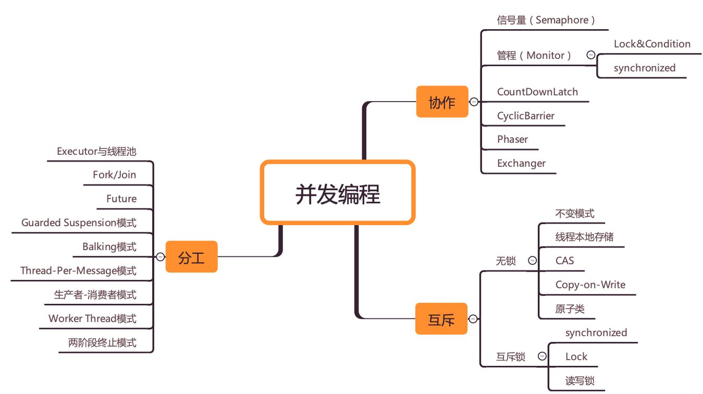

### Compile

```bash
$ javac *.java
```

### Implementations
a. Thread

b. wait()/notify

c. Lock/Condition

d. Semaphore

e. CountDownLatch

f. CyclicBarrier

g. ExecutorService

h. FutureTask

i: CompletableFuture

j: CompletionService

k: ForkJoinPool

l: Phaser

m: Exchanger



(image courtesy: https://time.geekbang.org/column/article/83267)