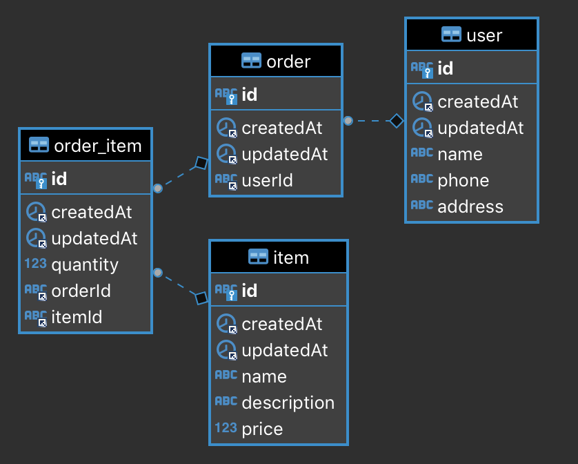

Week06 作业题目（周四）：

1.**（选做）** 尝试使用 Lambda/Stream/Guava 优化之前作业的代码。

// TODO

2.**（选做）** 尝试使用 Lambda/Stream/Guava 优化工作中编码的代码。

// TODO

3.**（选做）** 根据课上提供的材料，系统性学习一遍设计模式，并在工作学习中思考如何用设计模式解决问题。

// TODO

4.**（选做）** 根据课上提供的材料，深入了解 Google 和 Alibaba 编码规范，并根据这些规范，检查自己写代码是否符合规范，有什么可以改进的。

* [Google Java Style Guide](https://google.github.io/styleguide/javaguide.html)

* [Alibaba-Java-Coding-Guidelines](https://alibaba.github.io/Alibaba-Java-Coding-Guidelines/)

// TODO

Week06 作业题目（周六）：

1.**（选做）** 基于课程中的设计原则和最佳实践，分析是否可以将自己负责的业务系统进行数据库设计或是数据库服务器方面的优化

// TODO

2.**（必做）** 基于电商交易场景（用户、商品、订单），设计一套简单的表结构，提交 DDL 的 SQL 文件到 Github（后面 2 周的作业依然要是用到这个表结构）。

见`shop.sql`

### 设计考量

#### id

* 自增
  * (+)数据库内置功能
  * (+)按顺序，插入效率高
  * (-)分布式情况下需外部发号器
* uuid
  * (-)占用空间大
  * (-)无顺序，插入效率取决于WAL
  * (+)重复概率极小，一定规模下分布式友好

#### 日期

* 日期类型
  * (+)可使用数据库的日期函数
  * (-)默认精度不高
* 时间戳
  * (+)应用层处理日期更灵活
  * (-)默认精度存在2038问题

#### 商品

* 下单商品通常为SKU，展示商品通常为SPU。SKU通常带规格，这里省略
* 商品库存。对热门商品的秒杀减库存是个复杂的系统，这里省略
* 商品上下架。商品上架后不可修改，下架后不可购买。用来保留商品的历史版本，用于订单中的商品快照。这里省略
* 若是电商平台，还需要记录店铺信息。这里省略
* 若有自建仓库，则需要有商品入库和出库等库房操作。这里省略

#### 订单

* 订单通常有打包，发货，收货，完成/取消等各种状态，对接售前、支付、物流和售后等流程。这里省略

3.**（选做）** 尽可能多的从“常见关系数据库”中列的清单，安装运行，并使用上一题的 SQL 测试简单的增删改查。

// TODO

4.**（选做）** 基于上一题，尝试对各个数据库测试 100 万订单数据的增删改查性能。

// TODO

5.**（选做）** 尝试对 MySQL 不同引擎下测试 100 万订单数据的增删改查性能。

// TODO

6.**（选做）** 模拟 1000 万订单数据，测试不同方式下导入导出（数据备份还原）MySQL 的速度，包括 jdbc 程序处理和命令行处理。思考和实践，如何提升处理效率。

// TODO

7.**（选做）** 对 MySQL 配置不同的数据库连接池（DBCP、C3P0、Druid、Hikari），测试增删改查 100 万次，对比性能，生成报告。

// TODO
